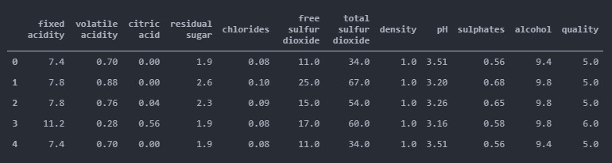
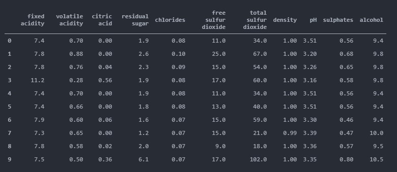
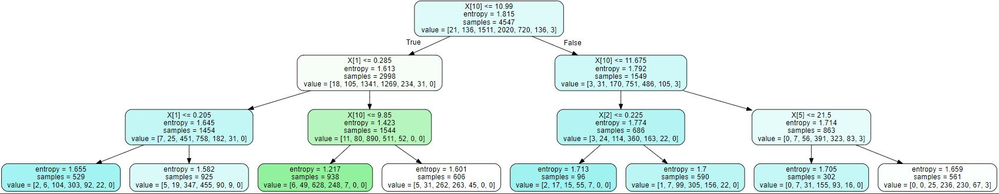
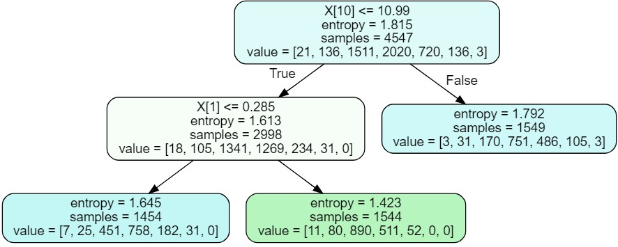
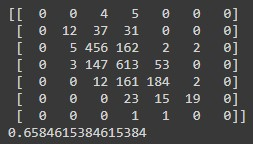
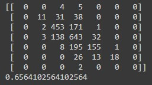
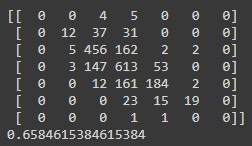

# INTELIGENCIA ARTIFICIAL- UNIVERSIDAD DEL NORTE
PROGRAMA DE INGENIERÍA DE SISTEMAS <br>
PROFESOR: EDUARDO ZUREK, PH.D.<br>
<b>INTEGRANTES</b>:
<br>
<ul>
    <li>Johan Sebastian Burgos Guerrero</li>
    <li>Sebastian David Ariza Coll</li>
    <li>Daniel Valencia Cordero</li>
</ul>
<hr>
Temas: Árboles de Decisión (entropía, impureza, Random Forest, Tree Bagging), Clasificadores Bayesianos Ingenuos (NaïveBayes Classifiers)

## Lectura de documentos CSV
Se realizo la lectura y concatenacion de los dos datasets con la libreria pandas, la union de estos dos datasets se importo como csv y se utilizo para crear la variable data que contiene todo nuestro conjunto de datos a utilizar.
Write about 1-2 paragraphs describing the purpose of your project.



## Verificacion de datos nulos

```
data.isnull().sum()
```

## Seleccion de las variables para nuestro conjunto X
Se escogen las 11 primeras variables ya que la variable 12 es considerada nuestro fy, se crea un nuevo dataset X que contiene el conjunto de las 11 primeras variables.



## Se entrena el modelo
Se entrena el modelo con un estado aletorio de 1 a 10 y un tamaño indicado de teste del 30% del dataset

## Árboles de decisión basados en entropía (Shannon)
Con los datos anteriores y el modelo creado se crean los siguientes arboles de decisión:

### Dos árboles de decisión, cada uno con un nivel diferente de profundidad.
```
clf = tree.DecisionTreeClassifier(
    criterion= "entropy",
    splitter= "best",
    max_depth=2,
    #min_samples_split= 10,
    #min_samples_leaf=10,
    min_weight_fraction_leaf=0.0,
    max_features=None,
    random_state=None,
    max_leaf_nodes=None,
    #min_impurity_decrease=0.05,
    class_weight=None,
    ccp_alpha = 0.0)
clf = clf.fit(x_train, y_train)
dot_data = tree.export_graphviz(clf, out_file=None,filled=True,rounded=True) 
graph = graphviz.Source(dot_data)
graph
```


```
clf = tree.DecisionTreeClassifier(
    criterion= "entropy",
    splitter= "best",
    max_depth=3,
    #min_samples_split= 10,
    #min_samples_leaf=10,
    min_weight_fraction_leaf=0.0,
    max_features=None,
    random_state=None,
    max_leaf_nodes=None,
    #min_impurity_decrease=0.05,
    class_weight=None,
    ccp_alpha = 0.0)
clf = clf.fit(x_train, y_train)

dot_data = tree.export_graphviz(clf, out_file=None,filled=True,rounded=True) 
graph = graphviz.Source(dot_data)
graph
```



#### Conclusiones
Basados en las precisiones calculadas con base en el número de profundidad en los árboles generados, podemos observar que a mayor número de profundidad, dicha presición será mucho mejor, en este caso el sistema logra clasificar el 57% de los datos de manera correcta, el cual es 6% mejor que tener un arbol con poca profundidad.

### Dos árboles de decisión (diferentes a los anteriores), sin limitar la profundidad, pero cada uno con diferentes números de nodos hoja.

```
clf = tree.DecisionTreeClassifier(
    criterion= "entropy",
    splitter= "best",
    # max_depth=3,
    #min_samples_split= 10,
    #min_samples_leaf=10,
    min_weight_fraction_leaf=0.0,
    max_features=None,
    random_state=None,
    max_leaf_nodes=3,
    #min_impurity_decrease=0.05,
    class_weight=None,
    ccp_alpha = 0.0)
clf = clf.fit(x_train, y_train)
dot_data = tree.export_graphviz(clf, out_file=None,filled=True,rounded=True) 
graph = graphviz.Source(dot_data)
graph
```



```
clf = tree.DecisionTreeClassifier(
    criterion= "entropy",
    splitter= "best",
    # max_depth=3,
    #min_samples_split= 10,
    #min_samples_leaf=10,
    min_weight_fraction_leaf=0.0,
    max_features=None,
    random_state=None,
    max_leaf_nodes=1000,
    #min_impurity_decrease=0.05,
    class_weight=None,
    ccp_alpha = 0.0)
clf = clf.fit(x_train, y_train)
dot_data = tree.export_graphviz(clf, out_file=None,filled=True,rounded=True) 
graph = graphviz.Source(dot_data)
graph
```


#### Conclusiones
Con base en los dos árboles generados y las pruebas realizadas, podemos asegurar que un al generar árboles con un mayor número de hojas es más probable tener una mejor precisición en estos, no obstante esto no asegura que al tener un número muy grande en cantidad de hojas haga que dicha precisión aumente.

### Dos árboles de decisión (diferentes a los anteriores), sin limitar la profundidad, pero cada uno con diferentes umbrales de ganancia al generar los nodos hijos.

```
clf = tree.DecisionTreeClassifier(
    criterion= "entropy",
    splitter= "best",
    max_depth=None,
    #min_samples_split= 10,
    #min_samples_leaf=10,
    min_weight_fraction_leaf=0.0,
    max_features=None,
    random_state=None,
    max_leaf_nodes=None,
    min_impurity_decrease=0.0001,
    class_weight=None,
    ccp_alpha = 0.0)
clf = clf.fit(x_train, y_train)
dot_data = tree.export_graphviz(clf, out_file=None,filled=True,rounded=True) 
graph = graphviz.Source(dot_data)
graph
```


```
clf = tree.DecisionTreeClassifier(
    criterion= "entropy",
    splitter= "best",
    max_depth=None,
    #min_samples_split= 10,
    #min_samples_leaf=10,
    min_weight_fraction_leaf=0.0,
    max_features=None,
    random_state=None,
    max_leaf_nodes=None,
    min_impurity_decrease=0.09,
    class_weight=None,
    ccp_alpha = 0.0)
clf = clf.fit(x_train, y_train)
dot_data = tree.export_graphviz(clf, out_file=None,filled=True,rounded=True) 
graph = graphviz.Source(dot_data)
graph
```


#### Conclusiones
Al basarnos en diferentes umbrales de ganancia, si consideramos generar árboles con un menor umbral de ganancia se tendrá así más profundidad en los mismos, por tanto es más probable que la precisión aumente.

## Random Forest

### Dos sistemas diferentes fijando el número de características que usados para la clasificación, pero variando el número de árboles.

```
clf = RandomForestClassifier(
          n_estimators =100, #cantidad de árboles
          #integer, optional (default=100)
          criterion="gini",
          #string, optional (default=”gini”)
          max_depth=None,
          #integer or None, optional (default=None)
          min_samples_split=2,
          #int, float, optional (default=2)
          min_samples_leaf=1,
          #int, float, optional (default=1)
          min_weight_fraction_leaf=0.0,
          #float, optional (default=0.)
          max_features=0.01,# caracteristicas
          #int, float, string or None, optional (default=”auto”)
          max_leaf_nodes=None,
          #int or None, optional (default=None)
          min_impurity_decrease=0.0,
          #float, optional (default=0.)
          bootstrap=True,
          #boolean, optional (default=True)
          oob_score=False,
          #bool (default=False)
          n_jobs=None,
          #int or None, optional (default=None)
          random_state=None,
          #int, RandomState instance or None, optional (default=None)
          verbose=0,
          #int, optional (default=0)
          warm_start=False,
          #bool, optional (default=False)
          ccp_alpha=0.0,
          #non-negative float, optional (default=0.0)
          max_samples=None
          #int or float, default=None
          )
clf.fit(x_train, y_train)
y_predict = clf.predict(x_test)
CM = confusion_matrix(y_test, y_predict)

print(CM)
score = clf.score(x_test, y_test)
print(score)
```


```
clf = RandomForestClassifier(
          n_estimators =100, #cantidad de árboles
          #integer, optional (default=100)
          criterion="gini",
          #string, optional (default=”gini”)
          max_depth=None,
          #integer or None, optional (default=None)
          min_samples_split=2,
          #int, float, optional (default=2)
          min_samples_leaf=1,
          #int, float, optional (default=1)
          min_weight_fraction_leaf=0.0,
          #float, optional (default=0.)
          max_features=10,# caracteristicas
          #int, float, string or None, optional (default=”auto”)
          max_leaf_nodes=None,
          #int or None, optional (default=None)
          min_impurity_decrease=0.0,
          #float, optional (default=0.)
          bootstrap=True,
          #boolean, optional (default=True)
          oob_score=False,
          #bool (default=False)
          n_jobs=None,
          #int or None, optional (default=None)
          random_state=None,
          #int, RandomState instance or None, optional (default=None)
          verbose=0,
          #int, optional (default=0)
          warm_start=False,
          #bool, optional (default=False)
          ccp_alpha=0.0,
          #non-negative float, optional (default=0.0)
          max_samples=None
          #int or float, default=None
          )

clf.fit(x_train, y_train)
y_predict = clf.predict(x_test)
CM = confusion_matrix(y_test, y_predict)

print(CM)
score = clf.score(x_test, y_test)
print(score)
```



#### Conclusiones
Podemos observar que entre mayor número de árboles, la precisión será mucho mejor.


### Dos sistemas diferentes fijando el número de árboles, pero cambiando el número de características usado para la clasificación.

```
clf = RandomForestClassifier(
          n_estimators =100, #cantidad de árboles
          #integer, optional (default=100)
          criterion="gini",
          #string, optional (default=”gini”)
          max_depth=None,
          #integer or None, optional (default=None)
          min_samples_split=2,
          #int, float, optional (default=2)
          min_samples_leaf=1,
          #int, float, optional (default=1)
          min_weight_fraction_leaf=0.0,
          #float, optional (default=0.)
          max_features=0.01,# caracteristicas
          #int, float, string or None, optional (default=”auto”)
          max_leaf_nodes=None,
          #int or None, optional (default=None)
          min_impurity_decrease=0.0,
          #float, optional (default=0.)
          bootstrap=True,
          #boolean, optional (default=True)
          oob_score=False,
          #bool (default=False)
          n_jobs=None,
          #int or None, optional (default=None)
          random_state=None,
          #int, RandomState instance or None, optional (default=None)
          verbose=0,
          #int, optional (default=0)
          warm_start=False,
          #bool, optional (default=False)
          ccp_alpha=0.0,
          #non-negative float, optional (default=0.0)
          max_samples=None
          #int or float, default=None
          )

clf.fit(x_train, y_train)
y_predict = clf.predict(x_test)
CM = confusion_matrix(y_test, y_predict)
print(CM)
score = clf.score(x_test, y_test)
print(score)
```



```
clf = RandomForestClassifier(
          n_estimators =100, #cantidad de árboles
          #integer, optional (default=100)
          criterion="gini",
          #string, optional (default=”gini”)
          max_depth=None,
          #integer or None, optional (default=None)
          min_samples_split=2,
          #int, float, optional (default=2)
          min_samples_leaf=1,
          #int, float, optional (default=1)
          min_weight_fraction_leaf=0.0,
          #float, optional (default=0.)
          max_features=10,# caracteristicas
          #int, float, string or None, optional (default=”auto”)
          max_leaf_nodes=None,
          #int or None, optional (default=None)
          min_impurity_decrease=0.0,
          #float, optional (default=0.)
          bootstrap=True,
          #boolean, optional (default=True)
          oob_score=False,
          #bool (default=False)
          n_jobs=None,
          #int or None, optional (default=None)
          random_state=None,
          #int, RandomState instance or None, optional (default=None)
          verbose=0,
          #int, optional (default=0)
          warm_start=False,
          #bool, optional (default=False)
          ccp_alpha=0.0,
          #non-negative float, optional (default=0.0)
          max_samples=None
          #int or float, default=None
          )

clf.fit(x_train, y_train)
y_predict = clf.predict(x_test)
CM = confusion_matrix(y_test, y_predict)

print(CM)
score = clf.score(x_test, y_test)
print(score)
```



#### Conclusiones
Para este apartado, la precisión dependerá de las características que se tegan presentes a la hora de hacer la clasificación.


## Naïve Bayes Classifiers

### Sistema de clasificación Bayesiano Ingenuo

```
nbf = GaussianNB()

xf_train, xf_test, yf_train, yf_test, = train_test_split(X, data['quality'], test_size=0.3, random_state=1970)

nbf.fit(xf_train, yf_train)
Yf_pred = nbf.predict(xf_test)
print("Accuracy NB:",accuracy_score(yf_test, Yf_pred))
```
```
Accuracy NB: 0.02923076923076923
```
```
nbf = GaussianNB()

xf_train, xf_test, yf_train, yf_test, = train_test_split(X, data['quality'], test_size=0.99, random_state=1970)

nbf.fit(xf_train, yf_train)
Yf_pred = nbf.predict(xf_test)
print("Accuracy NB:",accuracy_score(yf_test, Yf_pred))
```
```
Accuracy NB: 0.45997201927561016
```
#### Conclusiones
Al realizar un sistema de clasifición bayesiano ingenuo, su precisión dependerá de la cantidad de datos que este se le otorgue.